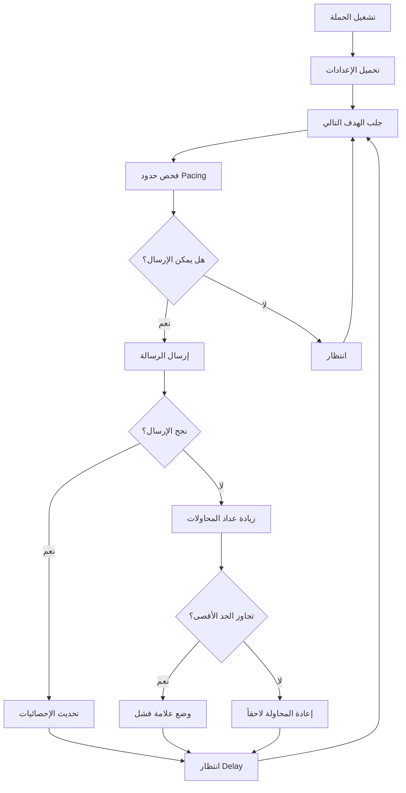
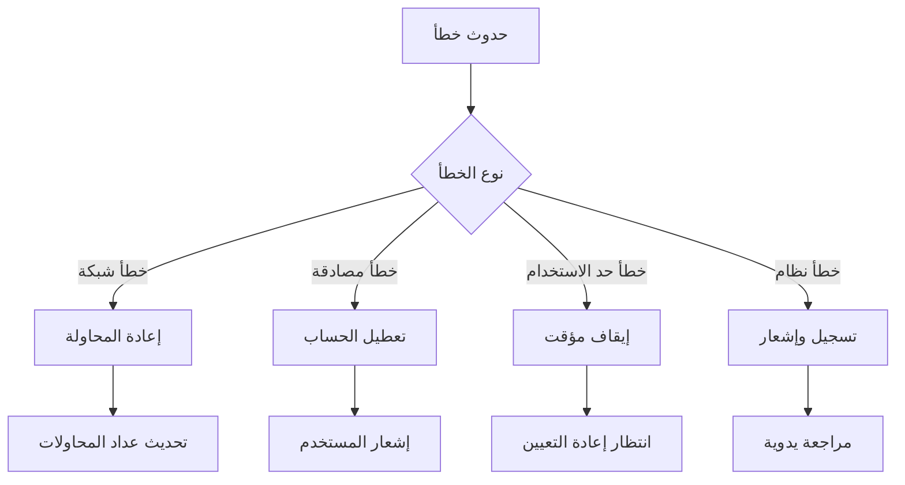

# 📖 Reachly - دليل المشروع الشامل

**تاريخ الإنشاء:** نوفمبر 2025  
**الإصدار:** v2.0.0  
**الحالة:** Production Ready

---

## 📋 جدول المحتويات

1. [🎯 نظرة عامة](#-نظرة-عامة)
2. [🏗️ البنية التقنية](#️-البنية-التقنية)
3. [📱 الصفحات والواجهات](#-الصفحات-والواجهات)
4. [⚙️ النظم الأساسية](#️-النظم-الأساسية)
5. [🔐 الأمان](#-الأمان)
6. [🚀 التطوير والنشر](#-التطوير-والنشر)
7. [📊 قاعدة البيانات](#-قاعدة-البيانات)
8. [🔄 سير العمل](#-سير-العمل)

---

## 🎯 نظرة عامة

### ما هو Reachly؟

**Reachly** هو منصة أتمتة التواصل على Twitter تسمح للمستخدمين بإنشاء وإدارة حملات الرسائل المباشرة والمتابعة بشكل آمن وفعال.

### الهدف الرئيسي

تمكين المستخدمين من:
- **إرسال رسائل مباشرة** بشكل تلقائي لقوائم مستهدفة
- **متابعة حسابات** بناءً على معايير محددة
- **إدارة حملات متعددة** من لوحة تحكم واحدة
- **تتبع الأداء** والإحصائيات في الوقت الفعلي

### المشكلة التي نحلها

1. **الإرسال اليدوي** يستغرق وقتاً طويلاً
2. **عدم وجود تحكم في السرعة** يؤدي للحظر
3. **صعوبة تتبع النتائج** والإحصائيات
4. **عدم وجود أتمتة** للمتابعة والتفاعل

---

## 🏗️ البنية التقنية

### Frontend Architecture

```
src/
├── pages/              # صفحات التطبيق الرئيسية
│   ├── Dashboard.tsx   # لوحة التحكم الرئيسية
│   ├── Campaigns.tsx   # إدارة حملات الرسائل
│   ├── FollowCampaigns.tsx  # إدارة حملات المتابعة
│   ├── Accounts.tsx    # إدارة حسابات Twitter
│   ├── Settings.tsx    # إعدادات المستخدم
│   └── auth/          # صفحات المصادقة
├── components/        # مكونات قابلة للإعادة
│   ├── ui/           # مكونات shadcn/ui
│   ├── layout/       # مكونات التخطيط
│   └── loading/      # مكونات التحميل
├── lib/              # مكتبات مساعدة
│   ├── api.ts        # عميل API
│   ├── auth.ts       # مساعدات المصادقة
│   └── utils.ts      # وظائف مساعدة
└── hooks/            # React Hooks مخصصة
```

### Backend Architecture

```
server/
├── index.ts          # نقطة الدخول الرئيسية
├── db-postgres.ts    # اتصال قاعدة البيانات
├── auth.ts           # نظام المصادقة
├── twitter.ts        # تكامل Twitter API
├── campaign-runner.ts # محرك تشغيل الحملات
├── follow-runner.ts  # محرك المتابعة
├── subscription.ts   # نظام الاشتراكات
├── queue.ts          # نظام الطوابير
└── logger.ts         # نظام السجلات
```

### التقنيات المستخدمة

#### Frontend Stack
- **React 18** + **TypeScript** - للواجهة الأمامية
- **Vite** - أداة البناء والتطوير
- **TailwindCSS** - إطار عمل CSS
- **shadcn/ui** - مكتبة المكونات
- **React Router** - التنقل بين الصفحات
- **Sonner** - نظام الإشعارات
- **Lucide React** - مكتبة الأيقونات

#### Backend Stack
- **Node.js** + **Express** - الخادم
- **TypeScript** - لغة البرمجة
- **PostgreSQL** - قاعدة البيانات الرئيسية
- **Redis** - التخزين المؤقت والطوابير
- **JWT** - المصادقة
- **bcrypt** - تشفير كلمات المرور
- **Winston** - نظام السجلات

---

## 📱 الصفحات والواجهات

### 1. Dashboard (لوحة التحكم)

**المسار:** `/dashboard`  
**الغرض:** عرض نظرة عامة على النشاط والإحصائيات

#### المكونات:
- **إحصائيات سريعة:** إجمالي الرسائل، الحملات النشطة، الحسابات المتصلة
- **النشاط الأخير:** آخر 5 حملات مع حالتها
- **الإجراءات السريعة:** إنشاء حملة جديدة، إدارة الحسابات، الإعدادات

#### الميزات:
- تحديث تلقائي كل 5 ثوانٍ
- إحصائيات في الوقت الفعلي
- روابط سريعة للمهام الشائعة

### 2. Campaigns (حملات الرسائل)

**المسار:** `/campaigns`  
**الغرض:** إدارة حملات الرسائل المباشرة

#### المكونات:
- **قائمة الحملات:** عرض جميع الحملات مع حالتها
- **أزرار التحكم:** Start/Pause/Stop لكل حملة
- **إحصائيات الحملة:** عدد الرسائل المرسلة/الفاشلة/المعلقة
- **فلترة وبحث:** تصفية الحملات حسب الحالة

#### الميزات:
- تحديث مباشر للإحصائيات
- تحكم كامل في الحملات
- تصدير البيانات CSV
- عرض تفاصيل كل حملة

### 3. Campaign Detail (تفاصيل الحملة)

**المسار:** `/campaigns/:id`  
**الغرض:** عرض تفاصيل حملة محددة

#### التبويبات:
1. **Overview:** الإحصائيات والتقدم
2. **Targets:** قائمة الأهداف مع البحث والفلترة
3. **Settings:** إعدادات الحملة والرسالة

#### الميزات:
- بحث وفلترة الأهداف
- تتبع حالة كل هدف
- عرض أخطاء الإرسال
- تصدير قائمة الأهداف

### 4. Campaign Wizard (معالج إنشاء الحملة)

**المسار:** `/campaigns/new` أو `/campaigns/wizard`  
**الغرض:** إنشاء حملة جديدة خطوة بخطوة

#### الخطوات:
1. **المعلومات الأساسية:** اسم الحملة، الحساب، العلامات
2. **الجمهور المستهدف:** اختيار الأهداف (يدوي أو استخراج متابعين)
3. **الرسالة:** كتابة قالب الرسالة مع المتغيرات
4. **الإعدادات:** تحديد سرعة الإرسال والحدود
5. **المراجعة:** مراجعة نهائية قبل الإنشاء

#### الميزات:
- حفظ كمسودة
- اختصارات لوحة المفاتيح (Ctrl+S)
- خطوات قابلة للنقر
- معاينة الرسالة

### 5. Follow Campaigns (حملات المتابعة)

**المسار:** `/follow-campaigns`  
**الغرض:** إدارة حملات المتابعة التلقائية

#### المكونات:
- **قائمة حملات المتابعة:** عرض جميع الحملات
- **إحصائيات المتابعة:** عدد المتابعات الناجحة/الفاشلة
- **أزرار التحكم:** تشغيل وإيقاف الحملات

### 6. Accounts (إدارة الحسابات)

**المسار:** `/accounts`  
**الغرض:** إدارة حسابات Twitter المتصلة

#### المكونات:
- **بطاقات الحسابات:** عرض شبكي للحسابات
- **مؤشرات الحالة:** نقاط ملونة للحالة (نشط/خطأ)
- **إحصائيات الاستخدام:** عدد الحملات، الرسائل، معدل النجاح
- **قائمة الإجراءات:** تحديث، حذف

#### الميزات:
- إضافة حسابات جديدة
- التحقق من صحة الحسابات
- عرض إحصائيات الاستخدام
- حذف الحسابات

### 7. Settings (الإعدادات)

**المسار:** `/settings`  
**الغرض:** إعدادات المستخدم والتطبيق

#### الأقسام:
- **الملف الشخصي:** تحديث المعلومات الشخصية
- **الأمان:** تغيير كلمة المرور
- **الإشعارات:** إعدادات التنبيهات
- **التفضيلات:** إعدادات عامة للتطبيق

---

## ⚙️ النظم الأساسية

### 1. نظام Pacing & Retry

#### الغرض:
منع حظر الحسابات من خلال التحكم في سرعة الإرسال

#### المكونات:
- **Messages per Minute:** عدد الرسائل في الدقيقة
- **Delay Range:** تأخير عشوائي بين الرسائل (5-15 ثانية)
- **Daily Cap:** حد يومي للرسائل
- **Retry Attempts:** عدد محاولات الإعادة عند الفشل

#### كيف يعمل:
```typescript
// مثال على إعدادات آمنة
const pacing = {
  perMinute: 3,        // 3 رسائل في الدقيقة
  delayMin: 15,        // تأخير أدنى 15 ثانية
  delayMax: 30,        // تأخير أقصى 30 ثانية
  dailyCap: 50,        // 50 رسالة يومياً
  retryAttempts: 2     // محاولتان إضافيتان عند الفشل
}
```

### 2. نظام المصادقة والأمان

#### JWT Authentication:
- توكن آمن لكل جلسة
- انتهاء صلاحية تلقائي
- تشفير قوي للبيانات

#### تشفير البيانات:
```typescript
// تشفير كوكيز Twitter
const encryptedCookies = encrypt(cookies, ENCRYPTION_KEY);

// تشفير كلمات المرور
const hashedPassword = await bcrypt.hash(password, 10);
```

### 3. نظام الطوابير (Queue System)

#### Redis Queues:
- طابور للرسائل المعلقة
- طابور للمتابعة
- طابور للمهام المؤجلة

#### معالجة الطوابير:
```typescript
// إضافة مهمة للطابور
await addToQueue('dm-queue', {
  campaignId,
  targetId,
  message,
  delay: calculateDelay()
});
```

### 4. نظام السجلات والمراقبة

#### Winston Logger:
- سجلات مفصلة لكل عملية
- مستويات مختلفة (info, warn, error)
- تخزين في ملفات منفصلة

#### مراقبة الأداء:
- تتبع أوقات الاستجابة
- مراقبة استخدام الذاكرة
- تنبيهات عند الأخطاء

---

## 🔐 الأمان

### 1. حماية البيانات

#### تشفير متعدد المستويات:
- **AES-256** لكوكيز Twitter
- **bcrypt** لكلمات المرور
- **JWT** للجلسات
- **HTTPS** لجميع الاتصالات

### 2. منع الهجمات

#### Rate Limiting:
```typescript
// حد أقصى 100 طلب في الدقيقة لكل IP
const limiter = rateLimit({
  windowMs: 60 * 1000,
  max: 100
});
```

#### Input Validation:
- تنظيف جميع المدخلات
- منع SQL Injection
- منع XSS Attacks

### 3. إدارة الصلاحيات

#### مستويات المستخدمين:
- **User:** مستخدم عادي
- **Premium:** مستخدم مميز
- **Admin:** مدير النظام

---

## 🚀 التطوير والنشر

### 1. بيئة التطوير

#### متطلبات النظام:
- Node.js 18+
- PostgreSQL 14+
- Redis 6+
- Git

#### إعداد البيئة:
```bash
# تثبيت المتطلبات
npm install

# إعداد قاعدة البيانات
npm run setup-db

# تشغيل التطوير
npm run dev:all
```

### 2. النشر على Railway

#### خطوات النشر:
1. ربط المستودع بـ Railway
2. إضافة PostgreSQL و Redis
3. تعيين متغيرات البيئة
4. نشر تلقائي عند Push

#### متغيرات البيئة المطلوبة:
```env
NODE_ENV=production
PORT=3001
JWT_SECRET=your-jwt-secret
COOKIE_ENCRYPTION_KEY=your-encryption-key
DATABASE_URL=postgresql://...
REDIS_URL=redis://...
```

### 3. CI/CD Pipeline

#### GitHub Actions:
- اختبار تلقائي عند Pull Request
- نشر تلقائي عند Push للـ main
- فحص الأمان والجودة

---

## 📊 قاعدة البيانات

### جداول PostgreSQL:

#### 1. users
```sql
CREATE TABLE users (
  id SERIAL PRIMARY KEY,
  email VARCHAR(255) UNIQUE NOT NULL,
  password_hash VARCHAR(255) NOT NULL,
  first_name VARCHAR(100),
  last_name VARCHAR(100),
  created_at TIMESTAMP DEFAULT CURRENT_TIMESTAMP
);
```

#### 2. accounts
```sql
CREATE TABLE accounts (
  id SERIAL PRIMARY KEY,
  user_id INTEGER REFERENCES users(id),
  username VARCHAR(50) NOT NULL,
  encrypted_cookies TEXT NOT NULL,
  is_valid BOOLEAN DEFAULT true,
  created_at TIMESTAMP DEFAULT CURRENT_TIMESTAMP
);
```

#### 3. campaigns
```sql
CREATE TABLE campaigns (
  id SERIAL PRIMARY KEY,
  user_id INTEGER REFERENCES users(id),
  account_id INTEGER REFERENCES accounts(id),
  name VARCHAR(255) NOT NULL,
  status VARCHAR(20) DEFAULT 'pending',
  message_template TEXT NOT NULL,
  pacing_per_minute INTEGER DEFAULT 3,
  pacing_delay_min INTEGER DEFAULT 15,
  pacing_delay_max INTEGER DEFAULT 30,
  pacing_daily_cap INTEGER DEFAULT 50,
  pacing_retry_attempts INTEGER DEFAULT 2,
  stats_total INTEGER DEFAULT 0,
  stats_sent INTEGER DEFAULT 0,
  stats_failed INTEGER DEFAULT 0,
  created_at TIMESTAMP DEFAULT CURRENT_TIMESTAMP
);
```

#### 4. targets
```sql
CREATE TABLE targets (
  id SERIAL PRIMARY KEY,
  campaign_id INTEGER REFERENCES campaigns(id),
  username VARCHAR(50) NOT NULL,
  name VARCHAR(100),
  status VARCHAR(20) DEFAULT 'pending',
  retry_count INTEGER DEFAULT 0,
  sent_at TIMESTAMP,
  last_attempt_at TIMESTAMP,
  error_message TEXT,
  created_at TIMESTAMP DEFAULT CURRENT_TIMESTAMP
);
```

---

## 🔄 سير العمل

### 1. إنشاء حملة جديدة

```mermaid
graph TD
    A[المستخدم ينقر "إنشاء حملة"] --> B[معالج الإنشاء]
    B --> C[اختيار الحساب والإعدادات]
    C --> D[إضافة الأهداف]
    D --> E[كتابة الرسالة]
    E --> F[تحديد إعدادات Pacing]
    F --> G[حفظ الحملة]
    G --> H[الحملة جاهزة للتشغيل]
```

### 2. تشغيل الحملة



### 3. إدارة الأخطاء



---

## 📈 الإحصائيات والتحليلات

### المقاييس المتتبعة:

1. **إحصائيات الحملة:**
   - عدد الرسائل المرسلة
   - معدل النجاح
   - الأخطاء والأسباب
   - الوقت المستغرق

2. **إحصائيات الحساب:**
   - عدد الحملات النشطة
   - إجمالي الرسائل المرسلة
   - معدل النجاح العام
   - آخر نشاط

3. **إحصائيات النظام:**
   - عدد المستخدمين النشطين
   - استخدام الموارد
   - أوقات الاستجابة
   - معدل الأخطاء

---

## 🔮 الخطط المستقبلية

### الميزات القادمة:

1. **تحسينات الذكاء الاصطناعي:**
   - توليد رسائل تلقائية
   - تحسين أوقات الإرسال
   - تحليل معدلات الاستجابة

2. **تكاملات جديدة:**
   - LinkedIn automation
   - Instagram DMs
   - Email campaigns

3. **تحسينات الأداء:**
   - تحسين قاعدة البيانات
   - تحسين واجهة المستخدم
   - إضافة المزيد من التحليلات

4. **ميزات متقدمة:**
   - A/B testing للرسائل
   - جدولة الحملات
   - تقارير مفصلة
   - API عام للمطورين

---

## 📞 الدعم والمساعدة

### الموارد المتاحة:

- **التوثيق التقني:** `/docs/`
- **API Documentation:** `/docs/API_DOCS.md`
- **دليل استكشاف الأخطاء:** `/docs/TROUBLESHOOTING.md`
- **نظام Pacing:** `/docs/PACING_AND_RETRY_SYSTEM.md`

### التواصل:

- **GitHub Issues:** للمشاكل التقنية
- **Email Support:** للاستفسارات العامة
- **Documentation:** للأدلة المفصلة

---

**© 2025 Reachly Team. جميع الحقوق محفوظة.**
